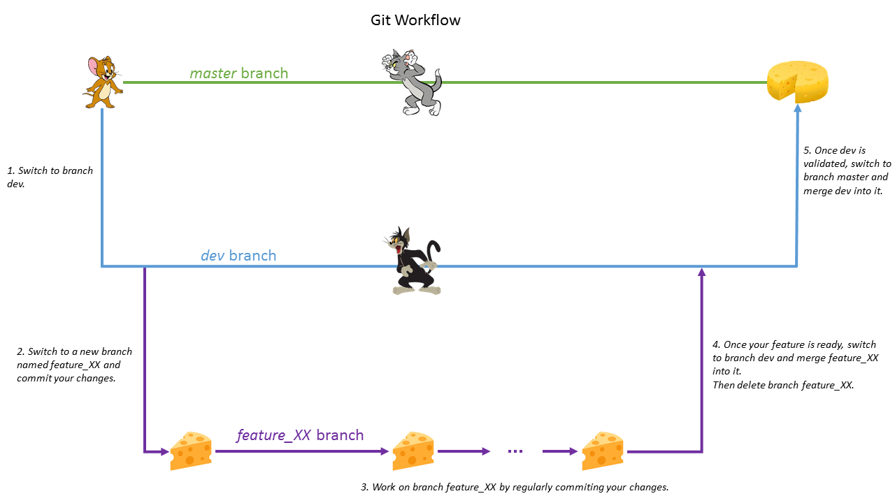

# Coding Rules

## Naming conventions
### Internal and external visibility
*Tolosat.IntExt*:
  > Items with external visibility shall be prefixed with `NAMESPACE_IN_UPPER_CASE__`.

Example:
```c
// The following constant is only used in the current file
#define C_EDATA_INFO_DEFAULT_VALUE (0)
// The following constant will be used in other files
#define PMU__C_PORT_LIFE_NAME_VALUE ("IOSLife")
```

#### Constant #defines and enum members
*Tolosat.DefEnumMemb:*
  > Constant #defines and enum members shall have the format `C_NAME_OF_CONSTANT`.

Example:
```c
#define C_PARTITION_MAIN_RETURN (1)

typedef enum
{
  C_EDATA_ERROR_TRSF_TYPE_UNKNOWN = 1 ,
  C_EDATA_ERROR_DEVICE_IDX_OUT_OF_RANGE,
  C_EDATA_ERROR_DEVICE_PROTOCOL_UNKNOWN
} E_EDATA_ERROR;
```

### Enumerated types
*Tolosat.EnumType:*
  > Enumerated types shall have the format `E_NAME_OF_TYPE`.

Example: see example for *Tolosat.DefEnumMemb*.

### Non-enumerated types
*Tolosat.CustomType:*
  > Non-enumerated types (eg. structures) shall have the format `T_NAME_OF_TYPE`.

Example:
```c
typedef struct
{
  T_UINT32               irq_nr;
  T_UINT32               sp;
  T_UINT32               spsr;
  T_UINT32               cpsr;
  T_UINT32               trap_sp;
  T_UINT32               pc;
} T_EDATA_INFO_UNEXPECTED_TRAP;
```

### Macros (aka function-like defines)
*Tolosat.Macro:*
  > Macros names shall have the format `M_NAME_OF_MACRO`.

Example:
```c
#define M_MAX(first_number, second_number) (((first_number) > (second_number)) ? (first_number) : (second_number))
```

### Variables
*Tolosat.Var:*
  > The name of non-global variables shall have the format `name_of_variable`.

Example:
```c
static void MyFunction(const T_UINT32 first_param, T_UINT32* const second_param) {

  T_UINT8 local_variable;
  const T_UINT32 greatest_value = M_MAX(first_param, *second_param);

  // ...
}
```

### Global variables
*Tolosat.GlobVar:*
  > Global non-constant variables names shall have the format `g_name_of_variable`.

Example:
```c
static T_INT8 g_global_variable;
T_UINT32 SSBL__g_other_variable;
```

### Global constants
*Tolosat.GlobConst:*
  > Global constant variables names shall have the format `C_NAME_OF_CONSTANT_VARIABLE`.

Example:
```c
static const T_UINT8 C_EDATA_INFO_DEFAULT_VALUE = 0;
```

### Functions
*Tolosat.Function:*
  > Function names shall have the format `NameOfFunction`.
  > _Exception:_ The entry point of the program can be named `main`.

Example:
```c
static E_OK_KO CheckDeviceIdx(T_UINT32 activity_idx,T_UINT32 device_idx);
```

```c
extern E_OK_KO DRIVER_DISPATCHER__InitDevicesDriversFromCT(PMU__T_ENGINEERING_DATA *edata);
```

## Other code-related rules
### Enum definitions
*Tolosat.EnumDef:*
  > When defining enum member, either the first element only or all elements shall be affected a value.

Example:
```c
typedef enum
{
  C_EDATA_ERROR_TRSF_TYPE_UNKNOWN = 1 ,
  C_EDATA_ERROR_DEVICE_IDX_OUT_OF_RANGE,
  C_EDATA_ERROR_DEVICE_PROTOCOL_UNKNOWN
} E_EDATA_ERROR;

typedef enum {
  BOARD_NAND__C_BLOCK_GOOD = 0x0,
  BOARD_NAND__C_NAND_BLOCK_BAD = 0x1,
  BOARD_NAND__C_NAND_BLOCK_RESERVED = 0x2,
  BOARD_NAND__C_NAND_BLOCK_FACTORY_BAD = 0x3
} BOARD_NAND__E_BLOCK_STATUS;
```

### Usage of `const` qualifier
*Tolosat.ConstQual:*
  > The `const` qualifier shall be used whenever possible.

### Header file layout
*Tolosat.HeaderLayout:*
  > Every header file shall use the following layout: TBD

### Source file layout
*Tolosat.SourceLayout:*
  > Every source file shall use the following layout: TBD

## Git workflow

Two main branches are used for every repository: *dev* and *master*. Each time a new feature should be implemented, create from *dev* a new branch *sprint_XX* designating the related sprint. Once the feature is completed, create a merge request to merge the branch into *dev*.

A merge request shall be *assigned* to one person who will effectively perform the merge operation. Additionally, one or more *approvers* who will review the changes shall be defined by adding their name in the 'Approvers' field; mandatory approvers shall be made clearly visible in the description of the merge request by the `Required approvers: ` mention.


